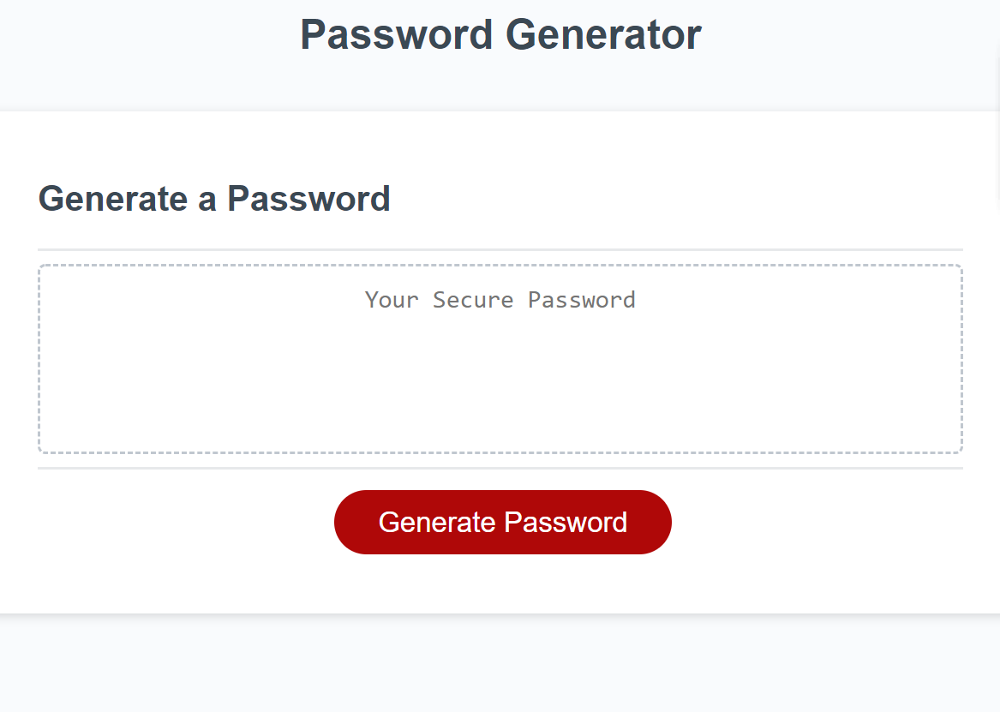
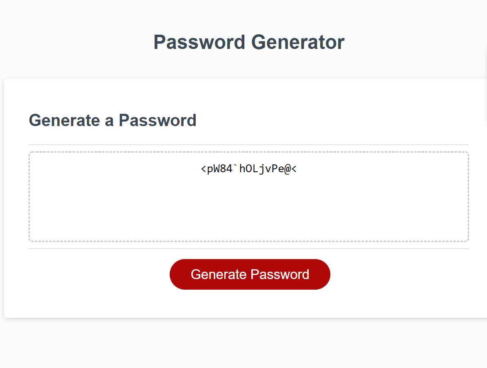

# Homework Day 3
## Password Generator
Application generates a password based on the criteria selected by the user.
## Demo of Web page
```
Allows the user to select the length of password and the characters that can be included in the password.
Length of the password should be at least 8 characters and no more than 128 characters and atleast one of the character should be selected for password generation.
```

The following images shows the web application's appearance and functionality:




## Technology used
JavaScript

**Note:** Modified only the javascript file.

### Links 
* [*GitHub repository*](git@github.com:daliyaebenny/password-generator.git)   
* [*GitHub pages*](https://daliyaebenny.github.io/password-generator/)
